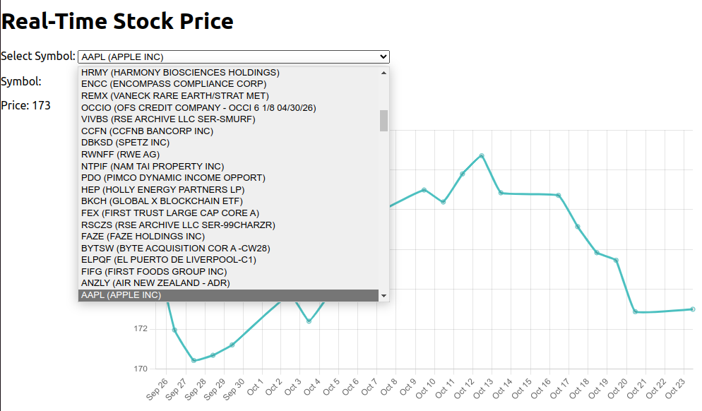

# Stock price website

## A simple website that allows users can monitor the real-time stock price in US

### Simple chart of each stock to give an insight about the market
### Currently improve the UI and make some machine learning algorithm for predict the market

## Tech stack: JavaScript, React, MongoDB, Finnhub API

## Screenshots:
